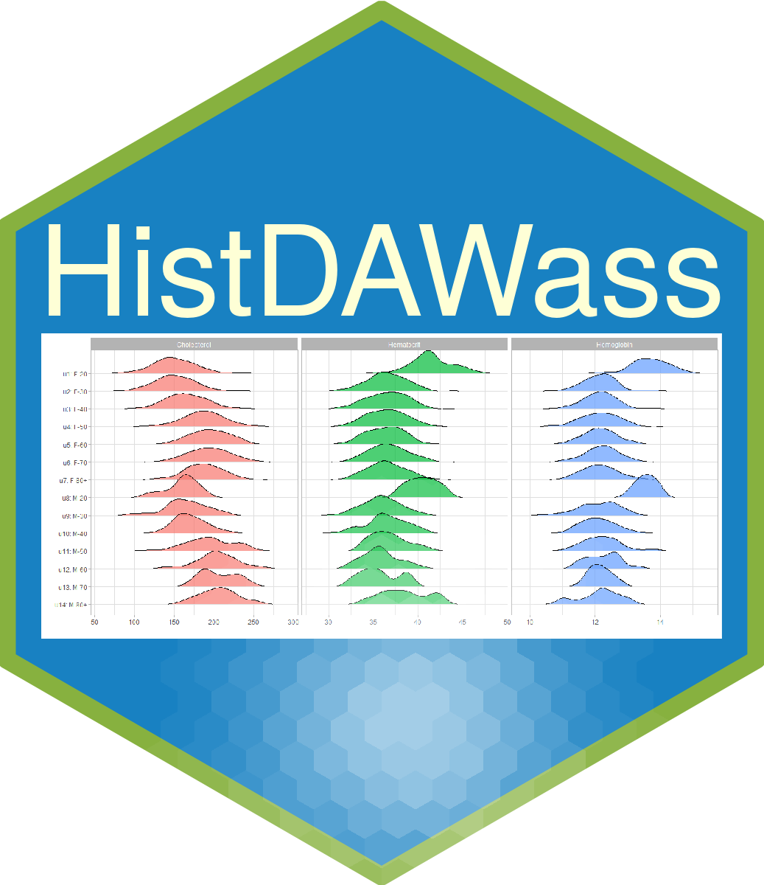

<!-- README.md is generated from README.Rmd. Please edit that file -->
<<<<<<< HEAD
=======


HistDAWass
==========
>>>>>>> cc4841cbad42739350a2f09c9b78d620fe2d9c1e

\#HistDAWass \#\#(Histogram-valued Data analysis using Wasserstein
metric)

In this document we describe the main features of the HistDAWass
package. The name is the acronym for Histogram-valued Data analysis
using Wasserstein metric. The implemented classes and functions are
related to the analysis of data tables containing histograms in each
cell instead of the classical numeric values.

In this document we describe the main features of the HistDAWass
package. The name is the acronym for Histogram-valued Data analysis
using Wasserstein metric. The implemented classes and functions are
related to the anlysis of data tables containing histograms in each cell
instead of the classical numeric values.

What is the L2 Wasserstein metric?

given two probability density functions *f* and *g*, each one has a
cumulative distribution function *F* and *G* and thei respectively
quantile functions (the inverse of a cumulative distribution function)
*Q*<sub>*f*</sub> and *Q*<sub>*g*</sub>. The L2 Wasserstein distance is

<<<<<<< HEAD
$$d_W(f,g)=\\sqrt{\\int\\limits_0^1{(Q_f(p) - Q_g(p))^2 dp}}$$
=======


>>>>>>> cc4841cbad42739350a2f09c9b78d620fe2d9c1e

The implemented classes are those described in the following table

| Class            | wrapper function for initializing                  | Description                                                                   |
|------------------|----------------------------------------------------|-------------------------------------------------------------------------------|
| `distributionH`  | `distributionH(x,p)`                               | A class describing a histogram distibution                                    |
| `MatH`           | `MatH(x, nrows, ncols,rownames,varnames, by.row )` | A class describing a matrix of distributions                                  |
| `TdistributionH` | `TdistributionH()`                                 | A class derived from distributionH equipped with a timestamp or a time window |
| `HTS`            | `HTS()`                                            | A class describing a Histgram-valued time series                              |

``` r
library(HistDAWass)
mydist=distributionH(x=c(0,1,2),p=c(0,0.3,1))
```

\#From raw data to histograms

> data2hist functions

\#Basic statistics for a distributionH (A histogram)

-   mean  
    + the mean of a histogram

-   standard deviation  
    + the standard deviation of a histogram

-   skewness

    -   the third standardized moment of a histogram

-   kurthosis

    -   the fourth standardized momemt of a histogram

\#Basic statistics for a MatH (A matrix of histogrm-valued data)

-   The average hisogram of a column  
    + It is an average **histogram** that minimizes the sum of squared
    Wasserstein distances.

-   The standard deviation of a variable  
    + It is a number that measures the dispersion of a set of
    histograms.

-   The covarince matrix of a MatH  
    + It is a matrix that measures the covariances into a set of
    hitogram variables.

-   The correlation matrix of a MatH  
    + It is a matrix that measures the correlation into a set of
    hitogram variables.

\#Visualization \> plot of a distributionH

> plot of a MatH

> plot of a HTS

\#Data Analysis methods

> Clustering

-   Kmeans

-   Adaptive distance based Kmeans

-   Fuzzy cmeans

-   Fuzzy cmeans based on adaptive Wasserstein distances

-   Kohonen batch self organizing maps

-   Kohonen batch self organizing maps with Wasserstein adaptive
    distances

-   Hierarchical clustering

> Dimension reduction techniques

-   Principal components analysis of a single histogram variable

-   Principal components analysis of a set of histogram variables (using
    Multiple Factor Analysis)

\#Methods for Histogram time series

> Smoothing

-   Moving averages

-   Exponential smoothing

> Forecasting

-   KNN prediction of histogram time series

\#Linear regression

> A two component model for a linear regression using Least Square
> method
